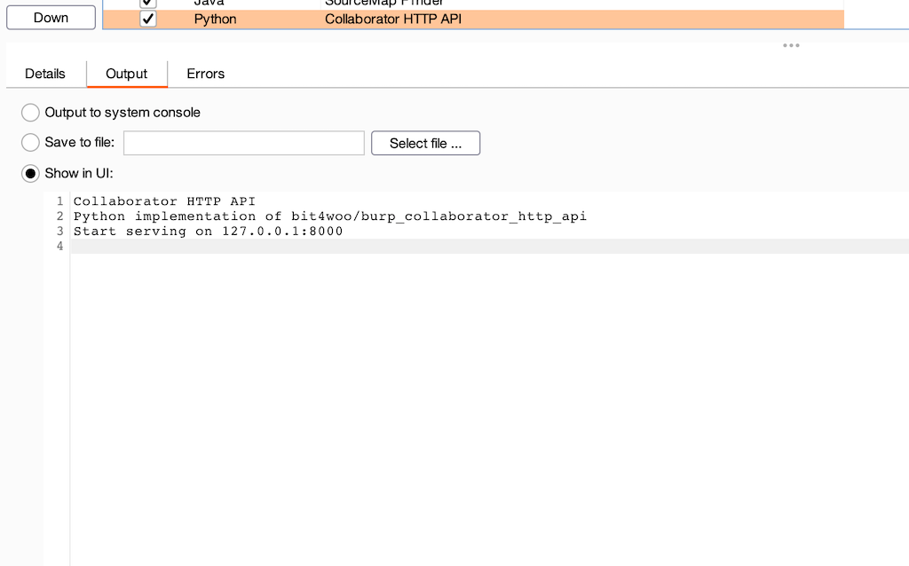

# Burp Plugins

## collaborator\_http\_api.py
A burp extender that let you use burp collaborator server through http api

http endpoint:  http://127.0.0.1:8000 (Hard-coded address & port)
```
GET /generatePayload
#> XYZ.burpcollaborator.net

GET /fetchFor?payload=XYZ
#> {u'client_ip': u'1.2.3.4', u'query_type': u'A', u'raw_query': u'bfoAEAABAAAAAAAAAjEwCjY4NjU2YzZjNmYeaGYwOTVqa2o3bGdrdXI1aDUzNjNuYnBoNThienpvEGJ1cnBjb2xsYWJvcmF0b3IDbmV0AAABAAE=', u'interaction_type': u'collaborator', u'time_stamp': u'2020-Dec-05 14:24:5
1 UTC', u'type': u'DNS', u'interaction_id': u'hf095jkj7lgkur5h5363nbph58bzzo'}
```




